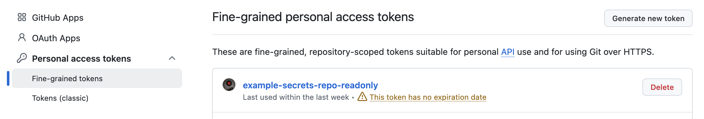
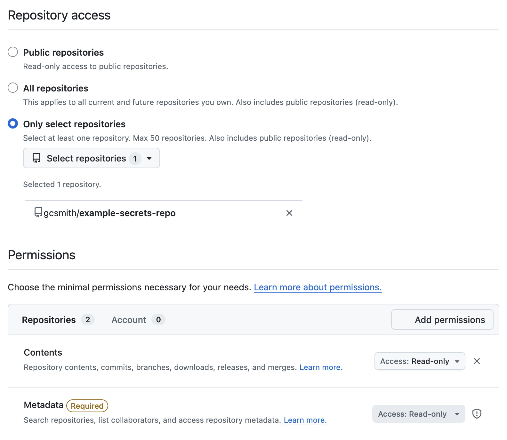
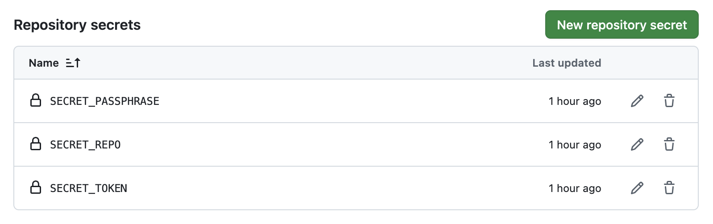
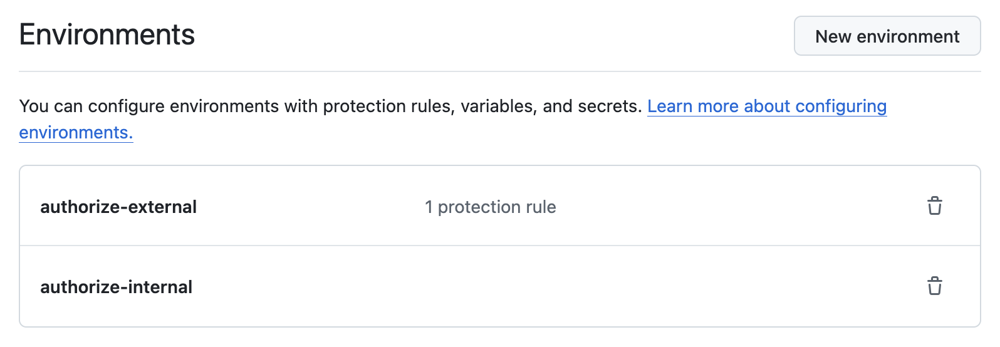
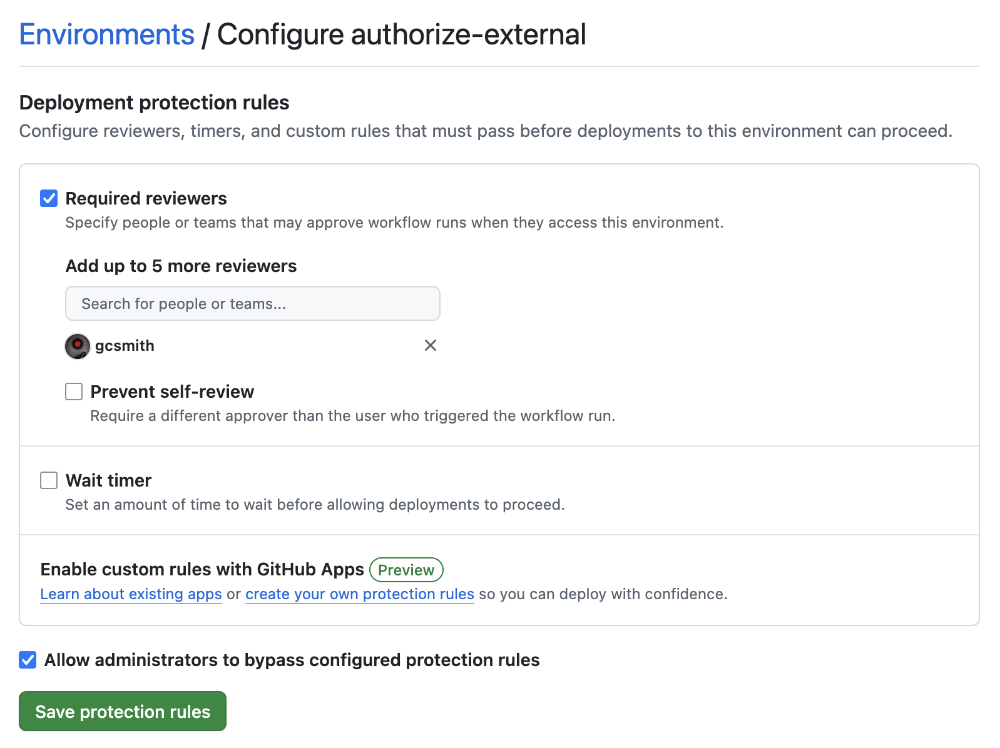

# example-secrets-flow

## Overview

This example project demonstrates how to access repo secrets safely from GitHub actions triggered by a pull request.

The following specific use-cases will be covered:
* avoiding pwn request attacks that attempt to leak repository secrets [1]
* storing large (> 48 KB) repository secrets [2]

## Organization

There are two repos for this example:

* `example-secrets-repo` - the repo containing secret file(s) and a decryption scripts
* `example-secrets-flow` - the repo that will consume the secret file

For this example, `example-secrets-repo` has been set to public visibility, but this would typically be private.

## Steps

### Encrypting the secret file

The contents of a secret are limited to 48 KB. Larger secrets can be stored in an encrypted file and stored directly in the repo. This file can then be decrypted using a decryption passphrase stored as a repository secret [1].

The secret in this example is `mystery.jpg`.

```bash
$ gpg --symmetric --cipher-algo AES256 mystery.jpg  # GPG will prompt user for passphrase
$ mkdir secrets && mv mystery.jpg.gpg secrets
```

### Generate fine-grained access token

Create a fine-grained token with read-only access to the private repo containing the secrets.

:arrow_right: `Account Settings > Developer Settings > Personal access tokens > Fine-grained tokens > Generate new token`

<kbd></kbd>

<kbd></kbd>

### Create repository secrets

Create the following repository secrets:

* `SECRET_PASSPHRASE` - the passphrase used to encrypt `mystery.jpg` via gpg in the previous steps
* `SECRET_REPO` - the name of the repo containing the secret in format `<user>/<repo>` (e.g., `gcsmith/example-secrets-repo)
* `SECRET_TOKEN` - the fine-grained access token generated in the previous steps

:arrow_right: `Project Settings > Security and quality > Secrets and variables > Actions > New repository secret`

<kbd></kbd>

### Create deployment environments

Create the following deployment environments:

* `authorize-internal` - the environment to use for internal events (`push`, `pull_request`)
* `authorize-external` - the environment to use for external (fork) events (`pull_request`, `pull_request_target`)

:arrow_right: `Project Settings > Code and automation > Environments > New environment`

<kbd></kbd>

For the `authorize-external` environment, add a 'Required reviewers' deployment protection rule. This will gate the action using this environment until the review explicitly approves the deployment.

<kbd></kbd>

### Use the deployment environments from your workflows

See the examples under `.github/workflows`:

* `regress-internal.yaml` - action to be run for internal events (push and PR *not* from a fork)
* `regress-external.yaml` - action to be run for external events (PR from a fork)
* `regress-validate.yaml` - the reusable workflow shared by both `regress-internal` and `regress-external`

## Resources

* [1] https://securitylab.github.com/resources/github-actions-preventing-pwn-requests
* [2] https://docs.github.com/en/actions/how-tos/write-workflows/choose-what-workflows-do/use-secrets#storing-large-secrets
* [3] https://dev.to/petrsvihlik/using-environment-protection-rules-to-secure-secrets-when-building-external-forks-with-pullrequesttarget-hci
